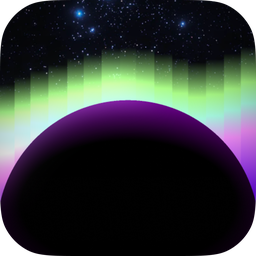
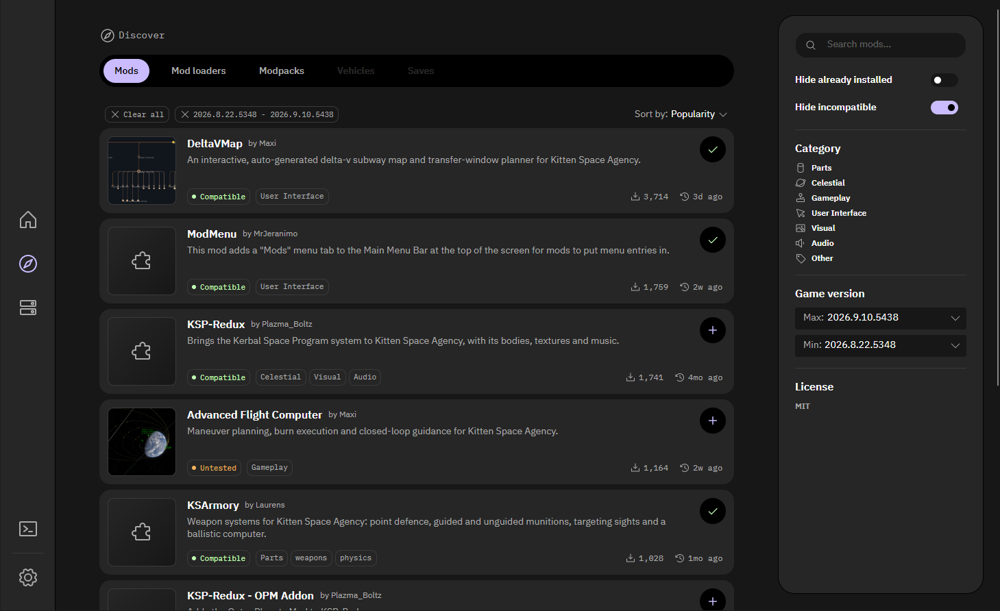

# Borea




Borea is a cross-platform content manager for Kitten Space Agency.

It is meant to manage mods, mod packs, vehicles, game saves, and more.
Mods and mod packs work today, and vehicles and game saves will follow later.
Borea installs them from the community content index, keeps them in separate instances, and starts the game with the instance you choose.
It runs on Windows, Linux and macOS, as a desktop App and as a command line.

Borea is a community project by the [KSA Modding](https://github.com/KSAModding) team.
It is not made by RocketWerkz and is not affiliated with or endorsed by them.
Kitten Space Agency is their game and their trademark.



## Help

- Questions and help: the [KSA Modding Society Discord](https://discord.gg/nt4fK4QuTz).
- Bugs: the [issue tracker](https://github.com/KSAModding/Borea/issues).
- See [CONTRIBUTING.md](CONTRIBUTING.md) to contribute and [SECURITY.md](SECURITY.md) to report a security problem.

## What it does

- Browse the [content index](https://github.com/KSAModding/content-index) and install mods with one click. Dependencies are resolved, recommendations are offered, and the mod loader is installed when a launch needs it.
- Keep several instances of the game, each with its own mods, saves and vehicles, and switch between them. Your game's own profile stays untouched.
- Update mods when a new release appears.
- Install mod packs, and export or import a mod list to share a setup.
- Start the game through the mod loader with the right instance, and see why a launch failed, with the mod that broke it and a button to disable it.
- Import the mods you installed by hand into an instance.
- Play time and last played per instance, the game log in the App, and a Tasks page that shows what Borea did.
- English, German and pirate speak, and a dark and a light theme.

Everything Borea knows about a mod comes from the content index, which the [content-manager-design](https://github.com/KSAModding/content-manager-design) RFCs define.
The index has two repositories: [content-index](https://github.com/KSAModding/content-index) holds the listings that mod authors write, and [content-index-releases](https://github.com/KSAModding/content-index-releases) holds the release files that are generated for each new release.
Listing a mod is a pull request with one TOML file in content-index.

## Downloads

Each release has two archives per platform.
The App archive contains one program, `borea` (`borea.exe` on Windows).
Started without arguments, it opens the desktop App.
Only one App runs for each user, so a second start brings the open window to the front.
Started with arguments, it runs a command, for example `borea --help`.
Started with one `borea://` link, such as `borea://mod/<id>`, it opens that page in the App, and on Windows and Linux the App registers itself for these links.
Most users want this archive.
The CLI archive contains only the command line.
It is a smaller download for scripts and for computers without a desktop.

The builds include the .NET runtime and are self-contained, so there is nothing you need to install first.

Each archive also contains `LICENSE` and `THIRD-PARTY-NOTICES.txt` with the licenses of the third-party software in it.

| Platform | App and CLI | CLI only |
| --- | --- | --- |
| Windows | `Borea-<version>-win-x64.zip` | `Borea-Cli-<version>-win-x64.zip` |
| Linux | `Borea-<version>-linux-x64.tar.gz` | `Borea-Cli-<version>-linux-x64.tar.gz` |
| macOS, Apple silicon | `Borea-<version>-macos-arm64.tar.gz` | `Borea-Cli-<version>-macos-arm64.tar.gz` |

The builds are not code signed, so the first start of each update takes an extra step on Windows and macOS.
Signing will be added at some point and is tracked in [issue #76](https://github.com/KSAModding/Borea/issues/76).

### Windows

1. Your browser might warn you that the file is not commonly downloaded. Keep it.
2. Before you unpack it, right-click the zip, open **Properties**, select **Unblock** on the **General** tab and confirm with **OK**.
3. Unpack the zip and start `borea.exe`. For the command line, run `.\borea.exe --help` in PowerShell in the unpacked folder of either archive.
4. If you skipped step 2, Windows shows "Windows protected your PC". The reason is that it detects that the App is not commonly downloaded and not signed. Select **More info**, then **Run anyway**.
5. If Windows says that Smart App Control blocked Borea, there is no "Run anyway". Go back to step 2, unblock the zip, and unpack it again into a new folder.

The warning comes back with every new version.
Borea does not need administrator rights.

On Windows 11 24H2 and later, the App opens without a console window.
On older Windows, a console window opens for a moment and closes when the App starts.
If you start `borea.exe` from the CLI archive by a double-click, it tells you to use a terminal and waits for Enter.

### Linux

Unpack the App archive and start `borea`, for example with `./borea` in a terminal in the unpacked folder.
For the command line, run `./borea --help` in the unpacked folder of either archive.
The build carries the .NET runtime but not the system libraries it sits on.
The App and the CLI both need the ICU and OpenSSL libraries.
Only the App also needs the X11, ICE, SM and fontconfig libraries.
Common desktop installations usually have all of them. A minimal one needs these packages for the App:

- Debian and Ubuntu: `sudo apt install libx11-6 libice6 libsm6 libfontconfig1 libssl3` plus the `libicu` package of your release, for example `libicu76`.
- Fedora: `sudo dnf install libX11 libICE libSM fontconfig libicu openssl-libs`.

For the CLI alone, install only `libssl3` and the `libicu` package on Debian and Ubuntu, or `libicu openssl-libs` on Fedora.

The build needs glibc, so musl-based distributions such as Alpine are not supported.

### macOS

Intel Macs are not supported.

Unpack the archive and start Borea from Terminal:

```sh
tar -xzf Borea-<version>-macos-arm64.tar.gz
cd Borea-<version>-macos-arm64
./borea
```

macOS might block that first start, because the build is not signed with an Apple developer account.
It says that Apple could not verify that `borea` is free of malware.
The full source code of Borea is in this repository, so you can check it yourself.

1. Select **Done**. Never select **Move to Trash**, because that deletes `borea`.
2. Open **System Settings**, go to **Privacy & Security** and scroll down to **Security**. It names `borea` there and offers **Open Anyway**.
3. Confirm with your password or Touch ID, then run `./borea` again. It starts.

Instead of the three steps you can remove the download mark in Terminal: `xattr -dr com.apple.quarantine Borea-<version>-macos-arm64`.
Either way, you do this once per version.

For the command line, run `./borea --help` in the same directory.
The matching `Borea-Cli-` archive contains only the command line.

Do not unpack the archive by double-clicking it in Finder, and do not start `borea` from Finder.

Once it runs, Borea behaves like any other Mac program.

### Checksums and provenance

`SHA256SUMS.txt` in each release lists the checksum of every archive and every software bill of materials.

GitHub also holds a build provenance attestation for every published file, which ties it to the workflow run that built it.

With `gh` signed in, check one like this:

```sh
gh attestation verify <file> --repo KSAModding/Borea \
  --signer-workflow KSAModding/Borea/.github/workflows/release.yml
```

`Borea-<version>.cdx.json` is the software bill of materials for the App archives, in CycloneDX JSON.
The App contains the command line, so this file lists the NuGet packages of the App and of the CLI.
`Borea-Cli-<version>.cdx.json` is the software bill of materials for the CLI archives and lists only the packages of the CLI.
Each file includes the version, license and hash of every package.
Each list is attested only to the archives that it describes, and you can use this command to prove that it belongs to one.
With `--format json`, the output includes the attested list.

```sh
gh attestation verify <archive> --repo KSAModding/Borea \
  --signer-workflow KSAModding/Borea/.github/workflows/release.yml \
  --predicate-type https://cyclonedx.org/bom
```

## Command line

`borea` runs Borea's operations from a script. Every read command takes `--json`.
The table shows the commands for settings and instances. `borea --help` lists them all, including search, show, install, update, remove, launch, loader and pack.
The exit code is 0 when the command completed, 1 when the operation failed and the reason is on stderr, and 2 when the command line did not parse.

| Command | Does |
| --- | --- |
| `borea settings show` | Print where the game, the mod loaders and the library are, and the release channel. |
| `borea settings set game <directory>` | Point Borea at the game installation. |
| `borea settings set loader <loader-id> <directory>` | Point Borea at an installed mod loader. |
| `borea settings set channel <channel>` | Choose which release statuses install and update offer: `stable` (the default), `testing` or `dev`. |
| `borea settings set library <directory>` | Move the instances and backups to another folder, or use the library that folder already holds. `--default` moves them back. |
| `borea game version` | Print the installed build and the current public build the master server reports. |
| `borea instance list` | Print every instance and mark the active one. |
| `borea instance show <instance>` | Print one instance, the mod loader its mods need, its launch arguments, when it was last played, and how long it was played. |
| `borea instance create <name>` | Create an empty instance. |
| `borea instance duplicate <instance> [--name <name>]` | Create an instance with the same mods, versions, and enabled flags. |
| `borea instance export <instance> [file]` | Write the mods of an instance, with their versions and enabled flags, as a modlist. |
| `borea instance import <file> [--name <name>]` | Create an instance from a modlist. |
| `borea instance rename <instance> <new-name>` | Give an instance a new name. |
| `borea instance arguments <instance>` | Print the launch arguments that every launch of an instance passes to the mod loader and the game. |
| `borea instance set-arguments <instance> -- <arguments>` | Save the arguments after `--` as the launch arguments of an instance, in place of the saved ones. |
| `borea instance clear-arguments <instance>` | Remove the launch arguments of an instance. |
| `borea instance delete <instance>` | Delete an instance, its folder, and the backups of its saves and vehicles. |
| `borea instance activate <instance>` | Make an instance the active one. |
| `borea instance deactivate` | Leave no instance active. |
| `borea instance scan <instance>` | Print the mod folders that Borea did not install, and whether the content index lists them. |
| `borea instance adopt <instance> <folder> --archive <path>` | Record a mod folder that Borea did not install as the index release its archive matches. |
| `borea instance import-profile <name> [--dry-run]` | Create an instance from copies of the mods in the shared profile, with the same load order and enabled state. The shared profile stays as it is. |
| `borea instance backups <instance>` | Print the backups of the saves and vehicles of an instance, newest first. |
| `borea instance restore-backup <instance> <backup> [--replace]` | Put a backup back where it came from. `--replace` first moves a save or vehicle of the same name into the backups. |
| `borea instance delete-backup <instance> <backup>` | Delete a backup for good. |
| `borea enable <mod-id> [--instance <instance>]` | Make the game load a mod. |
| `borea disable <mod-id> [--instance <instance>]` | Stop the game from loading a mod. |

## Repository structure

| Path | Description |
| --- | --- |
| `src/Borea.Core` | The domain model: mods, packs, instances, planning, the interfaces the other projects implement. No I/O. |
| `src/Borea.Storage` | Everything on disk: settings, instances, backups, TOML, the index cache. |
| `src/Borea.Network` | Everything over the network: the content index, SpaceDock, downloads, images. |
| `src/Borea.Composition` | The composition root. Builds every service from the saved settings, once, for the App and the CLI. |
| `src/Borea.App` | The desktop App, built with Avalonia. |
| `src/Borea.Cli` | The command line, `borea`. A thin wrapper over the same services. |
| `tests` | One test project per source project. |

## Building

Borea targets .NET 10. With the SDK installed:

```sh
dotnet build
dotnet test
dotnet run --project src/Borea.App
```

## Contributing

Read [CONTRIBUTING.md](CONTRIBUTING.md) first. Bugs go to the issue tracker, larger ideas to the [content-manager-design discussions](https://github.com/KSAModding/content-manager-design/discussions).

You do not need to write C# to improve a translation. The [localization guide](docs/localization.md) explains how to correct text or propose a new language from the GitHub website.

## Credits

- [MrJeranimo](https://github.com/MrJeranimo), creator and a maintainer of Borea, its architecture and direction.
- [Maximilian-Nesslauer](https://github.com/Maximilian-Nesslauer), the content index and its RFCs, and most of the App and the CLI as they are today.
- [averageksp](https://github.com/averageksp), App features, testing, and the content index listings.
- [PlazmaBoltz](https://github.com/PlazmaBoltz), the first interface and the themes.
- [renancamm](https://github.com/renancamm) (beik), UI/UX work for the App interface and the Borea icon.

And everyone who reported a bug, tested a build or listed a mod.

## License

Borea is under the [MIT license](LICENSE).
`THIRD-PARTY-NOTICES.txt` in each release lists the licenses of the software it ships with.
